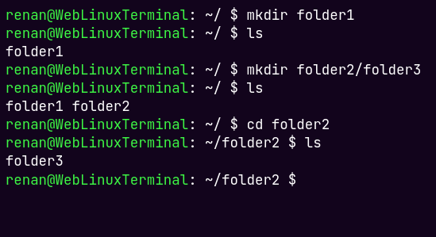

<!--Ad Maiorem Dei Gloriam-->


# 💻 Web Linux Terminal
A simple, but effective linux terminal sandbox that runs entirelly on front-end with JS. It can be useful for begginers to test unix-based commands.
----

----
## 🛠️ How to run?
As the sandbox terminal are in development, there's no site hosted at the moment. To run locally, follow the next steps:
1. Clone this repository using: 
    ```bash
    git clone https://github.com/Renan-G-projec/WebLinuxTerminal.git
    ```
2. Run the server (because of CORS policy) with:
    ```bash
    cd WebLinuxTerminal/src && npx http-server
    ```
3. Enter the returned domain and test it out!
----
## 📄 Commands
The commands are constantly updated. Here's the current one's: 
- `cd <path>` - changes the directory!
- `ls [path]` - list all the contents in a directory!
- `mkdir <path> [paths...]` - creates new folders!
- `touch <path> [paths...]` - creates new files!

----
## 🤝 Contributing
You-re totally free to contribute, no matter if you want to create a new command or simply correct a typo. Feel free to open a Pull Request and help the open source community!